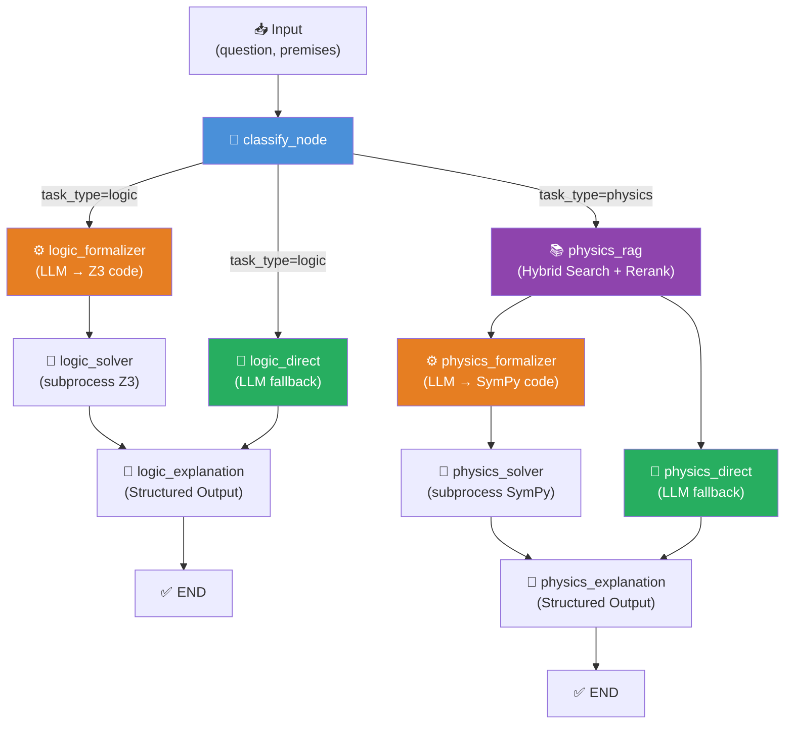
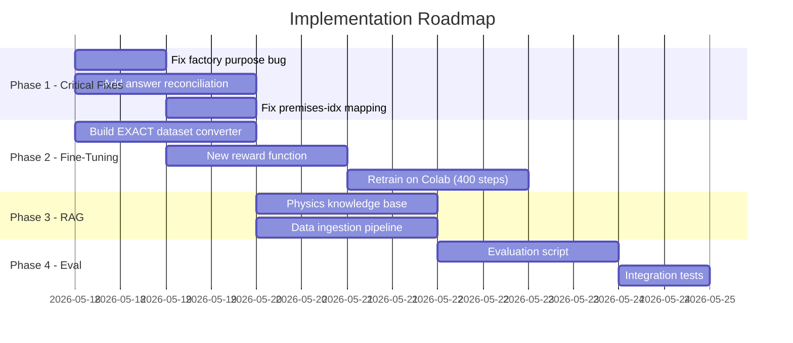

# EXACT 2026 — Pipeline Analysis & Implementation Plan

## 1. Tổng Quan Kiến Trúc Hiện Tại



### Luồng xử lý chi tiết

| Bước | Logic Branch | Physics Branch |
|------|-------------|----------------|
| 1 | `classify`: premises → logic | `classify`: LLM phân loại → physics |
| 2 | **Fan-out** song song: `formalizer` + `direct` | `physics_rag`: Hybrid search (Vector + BM25) → Rerank top 3 |
| 3 | `formalizer` → Z3 code | **Fan-out**: `formalizer` + `direct` |
| 4 | `solver` → subprocess chạy Z3 | `formalizer` → SymPy code → `solver` subprocess |
| 5 | `explanation` → ExactResponse | `explanation` → ExactResponse |

---

## 2. Đánh Giá Fine-Tuning

### 2.1 Cấu Hình Model

| Thông số | Giá trị | Đánh giá |
|----------|---------|----------|
| **Base model** | `DeepSeek-R1-0528-Qwen3-8B` | ✅ Tuân thủ ≤8B. DeepSeek-R1 rất mạnh về reasoning |
| **Quantization** | 4-bit (load_in_4bit) | ✅ Phù hợp T4 16GB VRAM |
| **LoRA rank** | 32 | ✅ Cân bằng tốt quality/memory |
| **Max seq length** | 2048 | ⚠️ Có thể ngắn cho CoT dài |
| **Phương pháp** | **GRPO** (Group Relative Policy Optimization) | ✅ RL-based, phù hợp cho reasoning |
| **Framework** | Unsloth 2026.5.2 + TRL | ✅ Tối ưu memory |

### 2.2 Training Hyperparameters

| Param | Giá trị | Đánh giá |
|-------|---------|----------|
| `learning_rate` | 5e-6 | ✅ Thận trọng, tránh catastrophic forgetting |
| `batch_size` | 2 | ✅ Phù hợp T4 |
| `gradient_accumulation` | 2 | ✅ Effective batch = 4 |
| `num_generations` | 2 | ⚠️ Nên tăng lên 4-6 để GRPO so sánh tốt hơn |
| `max_steps` | 50 | ❌ **Quá ít** — chỉ là demo, cần 300-500 steps |
| `max_completion_length` | 512 | ⚠️ Ngắn cho reasoning dài |
| `temperature` | 0.7 | ✅ Exploration tốt cho RL |

### 2.3 Reward Function — Phân Tích Chi Tiết

```python
# Hiện tại: reward_fn chỉ đánh giá FORMAT, KHÔNG đánh giá CORRECTNESS
score = 0.0
# +1.5 nếu có đúng 1 cặp <think>...</think>
# +0.0~1.0 dựa trên độ dài reasoning (word count / 200)
# +0.0~0.3 cho numbers found
# -0.5 nếu spam numbers > 15
```

> [!CAUTION]
> **Vấn đề nghiêm trọng**: Reward function **KHÔNG kiểm tra đáp án đúng/sai**. Đây là lỗ hổng lớn nhất — model chỉ học format, không học giải đúng.

### 2.4 Dataset — Vấn Đề Chính

> [!WARNING]
> **Sai dataset**: Notebook dùng `open-r1/DAPO-Math-17k-Processed` (Math chung) thay vì dữ liệu EXACT 2026 (Logic quy chế + Physics mạch điện). Model sẽ **KHÔNG** học được domain-specific knowledge.

| Vấn đề | Chi tiết |
|--------|---------|
| Dataset sai domain | Math chung ≠ Logic quy chế + Vật lý mạch điện |
| Chỉ 500 mẫu | Quá ít cho GRPO, cần ≥2000 |
| Không dùng data BTC | 411 records Type 1 + 1352 Type 2 chưa được sử dụng |
| Export GGUF | `q4_k_m` — OK cho inference local |

---

## 3. Đánh Giá Pipeline Hiện Tại

### 3.1 Điểm Mạnh ✅

1. **Kiến trúc song song** (fan-out) — formalizer + direct chạy đồng thời, đảm bảo luôn có fallback
2. **Symbolic solvers** (Z3/SymPy) — tăng độ chính xác computation so với pure LLM
3. **Structured Output** (Pydantic `ExactResponse`) — output luôn đúng schema
4. **Hybrid Retrieval** (Vector + BM25 + Rerank) — tốt cho physics knowledge
5. **Modular design** — dễ mở rộng thêm node

### 3.2 Vấn Đề Nghiêm Trọng ❌

| # | Vấn đề | File | Mức độ |
|---|--------|------|--------|
| 1 | **Không có logic chọn final vs fallback** | [graph.py](file:///d:/Exact%202026/src/agent/graph.py#L100-L103) | 🔴 Critical |
| 2 | **Classifier dùng purpose="reasoning" nhưng factory chỉ có rag/classifier/code/summary** | [classifier.py](file:///d:/Exact%202026/src/agent/nodes/classifier.py#L33) | 🔴 Bug |
| 3 | **LLM client dùng LlamaCpp (local GGUF) — nếu chưa download model sẽ crash** | [ollama_client.py](file:///d:/Exact%202026/src/llm/provider/ollama_client.py) | 🟡 Config |
| 4 | **Fine-tune sai domain + không check correctness** | Notebook | 🔴 Critical |
| 5 | **Chưa có answer reconciliation** giữa solver result và direct result | [logic_node.py](file:///d:/Exact%202026/src/agent/nodes/logic_node.py#L100-L135) | 🔴 Critical |
| 6 | **Physics RAG hardcode collection = "physics_knowledge"** nhưng chưa có data ingestion pipeline | [physics_node.py](file:///d:/Exact%202026/src/agent/nodes/physics_node.py#L35) | 🟡 Missing |
| 7 | **Premises trong prompt chưa kèm idx** (mất mapping premise nào cho question nào) | [logic_node.py](file:///d:/Exact%202026/src/agent/nodes/logic_node.py#L33) | 🟡 Accuracy |

---

## 4. Implementation Plan Chi Tiết

### Phase 1: Fix Critical Bugs (Ưu tiên cao nhất)

#### Task 1.1: Answer Reconciliation Node

**Vấn đề**: `explanation_node` nhận cả `final_answer` (từ solver) và `fallback_answer` (từ direct) nhưng **không so sánh** — chỉ ghi đè `final_answer`.

**Giải pháp**: Thêm logic chọn answer tốt nhất:

```python
# Trong logic_explanation_node / physics_explanation_node:
def _reconcile(state):
    solver_output = state["intermediate_answer"].get("code_output", "")
    fallback = state.get("fallback_answer", {})
    
    # Nếu solver thành công (có ANSWER: hoặc FINAL_ANSWER:)
    if "ANSWER:" in solver_output and "LỖI" not in solver_output:
        # Dùng solver result → explanation node xử lý
        return "solver"
    # Nếu solver fail → dùng fallback
    elif fallback.get("answer"):
        return "fallback"
    return "solver"  # default
```

#### Task 1.2: Fix Factory Purpose Bug

[classifier.py:33](file:///d:/Exact%202026/src/agent/nodes/classifier.py#L33) gọi `purpose="reasoning"` nhưng [factory.py](file:///d:/Exact%202026/src/llm/factory.py) chỉ hỗ trợ `rag|classifier|code|summary`. Sửa thành `purpose="classifier"`.

#### Task 1.3: Fix Premises-to-Question Mapping

Data Type 1 có `idx` field chỉ định **premise nào** dùng cho **question nào**. Hiện tại pipeline bỏ qua field này → gửi TẤT CẢ premises cho MỌI question.

```python
# Sửa trong run_pipeline hoặc thêm preprocessing:
# record["idx"][question_index] → danh sách index premises cần dùng
relevant_premises = [record["premises-NL"][i-1] for i in record["idx"][q_idx]]
```

### Phase 2: Fix Fine-Tuning (Song song với Phase 1)

#### Task 2.1: Tạo Dataset EXACT-specific cho GRPO

```python
# Chuyển đổi Type 1 (Logic):
{
    "prompt": "Premises:\n- If well-tested → optimized\n...\nQuestion: Which conclusion follows?",
    "answer": "A"  # ground truth
}

# Chuyển đổi Type 2 (Physics):
{
    "prompt": "Calculate energy stored in capacitor C=100μF, U=30V",
    "answer": "0.045 J"  # ground truth
}
```

#### Task 2.2: Reward Function Mới — Có Kiểm Tra Đáp Án

```python
def reward_fn(completions, answer, **kwargs):
    scores = []
    for c, gold in zip(completions, answer):
        text = c[0]["content"] if isinstance(c, list) else str(c)
        score = 0.0
        
        # 1. FORMAT REWARD (+1.5)
        if "<think>" in text and "</think>" in text:
            score += 1.5
            
        # 2. CORRECTNESS REWARD (+3.0) ← MỚI, QUAN TRỌNG NHẤT
        pred = extract_answer(text)  # parse <answer>...</answer>
        if normalize(pred) == normalize(gold):
            score += 3.0
        elif is_partial_match(pred, gold):
            score += 1.0
            
        # 3. REASONING QUALITY (+1.0)
        think_part = extract_between(text, "<think>", "</think>")
        if len(think_part.split()) > 50:
            score += 0.5
        if any(kw in think_part.lower() for kw in ["therefore", "because", "since"]):
            score += 0.5
            
        scores.append(score)
    return scores
```

#### Task 2.3: Training Config Cập Nhật

```python
GRPOConfig(
    max_steps = 400,             # 50 → 400
    num_generations = 4,         # 2 → 4 (so sánh nhiều hơn)
    max_completion_length = 1024, # 512 → 1024 (reasoning dài hơn)
    per_device_train_batch_size = 1,  # giảm nếu OOM
    gradient_accumulation_steps = 4,  # tăng bù batch size
)
```

### Phase 3: Data Pipeline & RAG

#### Task 3.1: Data Ingestion Script

Tạo `src/process/ingest_data.py`:

```python
# 1. Load Physics CSV → chunk theo từng bài
# 2. Tạo knowledge base: công thức, hằng số vật lý
# 3. Index vào Qdrant collection "physics_knowledge"
# 4. Load Logic JSON → tạo collection "logic_regulations" (optional)
```

#### Task 3.2: Physics Knowledge Base

Tạo file `data/physics_formulas.md` chứa:
- Công thức tụ điện (C = Q/U, E = 0.5CU², ...)
- Định luật Coulomb, Ohm
- Mạch nối tiếp/song song
- Index vào RAG để bổ sung context

### Phase 4: Evaluation & Testing

#### Task 4.1: Evaluation Script

```python
# src/eval/evaluate.py
# Load dataset → chạy pipeline → so sánh với ground truth
# Metrics: Accuracy, Explanation Quality (BLEU/ROUGE)
```

#### Task 4.2: Integration Test

```python
# tests/test_pipeline.py  
# Test từng node riêng lẻ + test end-to-end
```

---

## 5. Tóm Tắt Ưu Tiên



> [!IMPORTANT]
> **Ưu tiên tuyệt đối**: Phase 2 (Fix Fine-Tuning) vì model hiện tại train trên **sai dataset** và **không có correctness reward**. Dù pipeline hoàn hảo, model kém thì kết quả vẫn tệ.
