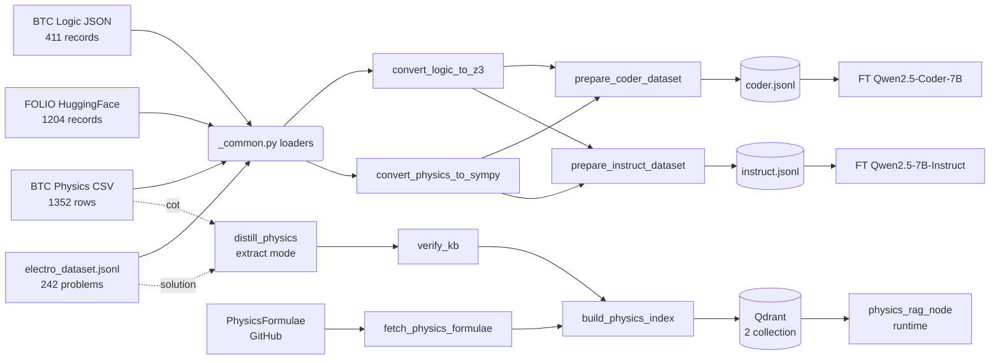

# EXACT 2026 — Scripts

Bộ công cụ Python phục vụ data pipeline + RAG cho cuộc thi **EXACT 2026**.

## Tổng quan

```
scripts/
├── README.md                       # File này
├── convert_logic_to_z3.py          # Engine: FOL → Z3 Python code
├── convert_physics_to_sympy.py     # Engine: LaTeX → SymPy Python code
├── data_prep/                      # Pipeline build dataset fine-tune
│   ├── _common.py                  # Loaders + ChatML formatter + verify exec
│   ├── prepare_coder_dataset.py    # → data/finetune/coder.jsonl
│   └── prepare_instruct_dataset.py # → data/finetune/instruct.jsonl
├── distill/                        # Knowledge distillation cho RAG
│   ├── distill_physics.py          # Teacher LLM → physics_kb.raw.jsonl
│   ├── verify_kb.py                # Exec SymPy → mark verified
│   └── fetch_physics_formulae.py   # Pull công thức từ PhysicsFormulae GitHub
└── rag/                            # Build vector index + smoke test
    ├── build_physics_index.py      # JSONL → 2 collection Qdrant
    └── smoke_rag.py                # Test 3 query (Coulomb / out-scope / RLC)
```

> [!NOTE]
> Hai engine `convert_*` ban đầu được pipeline cũ sử dụng. Sau khi tái cấu trúc,
> chúng được `data_prep/_common.py` import lại làm engine chuyển đổi mà không
> cần viết lại logic LaTeX/FOL parsing.

---

## Quick Start

### 1. Build fine-tune datasets

```powershell
# Coder dataset (Qwen2.5-Coder-7B-Instruct)
.\venv\Scripts\python.exe -m scripts.data_prep.prepare_coder_dataset

# Instruct dataset (Qwen2.5-7B-Instruct)
.\venv\Scripts\python.exe -m scripts.data_prep.prepare_instruct_dataset
```

Output → `data/finetune/`. Xem chi tiết tại `data/finetune/README.md`.

### 2. Build RAG knowledge base

```powershell
# A. Pull công thức điện từ + 6 hằng vật lý từ PhysicsFormulae (~28 records)
.\venv\Scripts\python.exe -m scripts.distill.fetch_physics_formulae --include-constants

# B. Distill thêm từ BTC + electro dataset (extract mode, gemini-2.5-flash-lite)
$env:GOOGLE_API_KEY = "<your-key>"
.\venv\Scripts\python.exe -m scripts.distill.distill_physics --source all
.\venv\Scripts\python.exe -m scripts.distill.verify_kb

# C. Index vào Qdrant (2 collection)
.\venv\Scripts\python.exe -m scripts.rag.build_physics_index --rebuild

# D. Smoke test
.\venv\Scripts\python.exe -m scripts.rag.smoke_rag
```

Xem chi tiết tại `data/distilled/README.md`.

---

## Chi tiết từng module

### 1. `convert_logic_to_z3.py` — FOL → Z3 Engine

**Mục đích:** Chuyển premises/conclusion ở dạng First-Order Logic
(Unicode `∀ ∃ ¬ ∧ ∨ →`) thành script Python sử dụng `z3-solver` để kiểm tra entailment.

**Conversion patterns:**

| FOL Unicode | Z3 Python                       |
| ----------- | ------------------------------- |
| `∀x P(x)`   | `ForAll(x, P(x))`               |
| `∃x P(x)`   | `Exists(x, P(x))`               |
| `¬P(x)`     | `Not(P(x))`                     |
| `P → Q`     | `Implies(P, Q)`                 |
| `P ∧ Q`     | `And(P, Q)`                     |
| `P ∨ Q`     | `Or(P, Q)`                      |
| Predicate   | `Function("P", Entity, BoolSort())` |

Engine tự detect predicate (uppercase) vs constant (lowercase), khai báo sort
`Entity` và emit `Solver()` + `s.add(...)` block đầy đủ.

### 2. `convert_physics_to_sympy.py` — LaTeX → SymPy Engine

**Mục đích:** Chuyển biểu thức LaTeX thành Python expression dùng được với `sympy`.

```powershell
.\venv\Scripts\python.exe scripts\convert_physics_to_sympy.py --generate --count 242
.\venv\Scripts\python.exe scripts\convert_physics_to_sympy.py --verify
```

| LaTeX                      | SymPy Python              |
| -------------------------- | ------------------------- |
| `\frac{a}{b}`              | `((a)/(b))`               |
| `\sqrt{x}`                 | `sqrt(x)`                 |
| `x^{2}`, `x^2`             | `x**(2)`, `x**2`          |
| `\sin x`                   | `sin(x)`                  |
| `\pi`, `\epsilon_0`        | `pi`, `epsilon_0`         |
| `\cdot`, `\times`          | `*`                       |
| `2x`, `3y` (implicit mult) | `2*x`, `3*y`              |

### 3. `data_prep/` — Pipeline build dataset fine-tune

| Output                | Model fine-tune              | Vai trò runtime                  |
| --------------------- | ---------------------------- | -------------------------------- |
| `coder.jsonl`         | Qwen2.5-Coder-7B-Instruct    | Sinh code Z3/SymPy               |
| `coder.eval.jsonl`    | (10% validation split)       |                                  |
| `instruct.jsonl`      | Qwen2.5-7B-Instruct          | Sinh `ExactResponse` JSON        |
| `instruct.eval.jsonl` | (10% validation split)       |                                  |

#### `_common.py`

- **Dataclass**: `LogicQA`, `PhysicsQA`, `ElectroSample`, `FolioSample`
- **Loader**: `load_btc_logic()`, `load_btc_physics()`, `load_electro_sympy()`, `load_folio()`
- **Converter**: `folio_to_z3()`, `get_sympy_engine()`
- **Verify**: `verify_python(code)` chạy `exec()` cô lập, capture stdout/stderr
- **ChatML**: `chatml(system, user, assistant, meta)` → dict
- **I/O**: `write_jsonl()`, `train_val_split()`, `write_stats_md()`

#### `prepare_coder_dataset.py` / `prepare_instruct_dataset.py`

| Source        | Records | Conversion                |
| ------------- | ------: | ------------------------- |
| `folio`       |    ~200 | FOL → Z3 (filter exec)    |
| `btc_physics` |  ~1,100 | LaTeX answer → SymPy stub |
| `electro`     |    ~220 | Pre-existing SymPy code   |

**Flags chung:** `--no-verify`, `--val-ratio 0.05`, `--no-electro`, `--seed`,
`--output-dir`. Riêng instruct có `--error-ratio 0.30`.

### 4. `distill/` — Knowledge distillation cho RAG

> [!IMPORTANT]
> Pipeline mới chuyển sang **extract mode**: dataset BTC đã có `cot` chứa
> formula + lời giải, teacher chỉ trích xuất ra schema KBRecord chuẩn,
> không sinh từ đầu. Model mặc định: `gemini-2.5-flash-lite` (rẻ nhất Flash).
> Cấu hình tại `config/setting.yaml` block `distillation`.

| Script                       | Vai trò                                                       |
| ---------------------------- | ------------------------------------------------------------- |
| `distill_physics.py`         | Async pipeline gọi teacher, resumable, ghi `*.raw.jsonl`      |
| `verify_kb.py`               | Subprocess exec từng `sympy_code` (timeout 10s) → `*.verified.jsonl` |
| `fetch_physics_formulae.py`  | Crawl + lọc 22 công thức + 6 hằng từ [PhysicsFormulae](https://github.com/BenjaminTMilnes/PhysicsFormulae) |

KB cuối cùng chỉ thuộc 2 topic theo scope EXACT 2026: `electrostatics` +
`electric_circuits`. Xem `data/distilled/README.md` để rõ schema, license.

### 5. `rag/` — Build vector index + smoke test

| Script                  | Vai trò                                                              |
| ----------------------- | -------------------------------------------------------------------- |
| `build_physics_index.py`| Đọc 1+ JSONL, build 2 collection Qdrant: `physics_examples` (per-record) + `physics_formulas` (per-topic). Hỗ trợ `--rebuild`, multi-input, auto-detect storage path. |
| `smoke_rag.py`          | Test retrieval với 3 query (Coulomb / 1 query out-scope / RLC). Print top-3 chunks + reranker score. |

```powershell
# Index từ nhiều file (gộp PhysicsFormulae + distilled BTC)
python -m scripts.rag.build_physics_index `
    --input data/distilled/physics_kb.from_pf.jsonl `
    --input data/distilled/physics_kb.verified.jsonl `
    --rebuild
```

---

## Yêu cầu

```powershell
pip install -r requirements.txt
```

Tối thiểu cho data_prep: `datasets z3-solver sympy pandas python-dotenv`.
Thêm cho distillation: `google-generativeai`.
Thêm cho RAG: `qdrant-client llama-index FlagEmbedding`.

---

## Workflow



---

## Lưu ý

- **Q19 filter** đã được apply trong `load_btc_physics()`: drop row có `id` bắt
  đầu bằng `QA`. Bản 2026-05-15 đã clean sẵn (1,352 rows), filter để defensive
  cho dataset tương lai.
- **FOLIO offline**: nếu HuggingFace Hub không truy cập, `load_folio()` in cảnh
  báo và trả `[]`; pipeline vẫn build với 2 nguồn còn lại.
- **Scope EXACT 2026**: theo `data/EXACT_Slides.pdf` trang 22, chỉ 2 topic:
  electric circuits + electrostatics. KB và `topic` enum trong distillation đã
  hẹp xuống đúng scope này.
- **PhysicsFormulae cache**: file `Compiled.json` (~655 KB) tải về
  `data/external/` đã được ignore khỏi git (rebuild được bằng `fetch_physics_formulae.py`).
- **Console encoding**: nếu PowerShell báo `UnicodeEncodeError`, set:
  ```powershell
  $env:PYTHONUTF8="1"; $env:PYTHONIOENCODING="utf-8"
  ```
