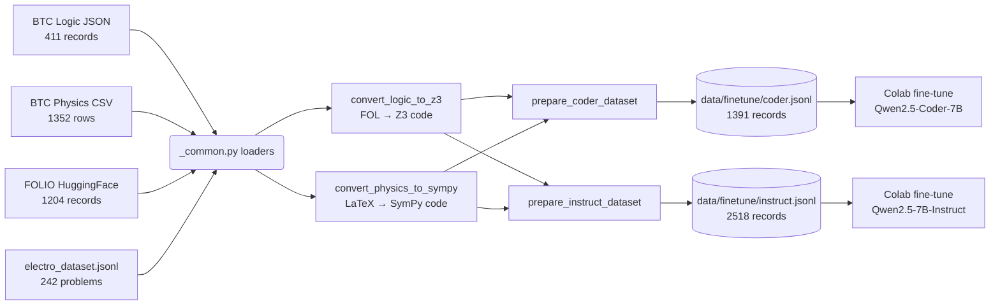

# EXACT 2026 — Scripts

Bộ công cụ Python phục vụ data pipeline cho cuộc thi **EXACT 2026**.

## Tổng quan

```
scripts/
├── README.md                       # File này
├── convert_logic_to_z3.py          # Engine: FOL → Z3 Python code
├── convert_physics_to_sympy.py     # Engine: LaTeX → SymPy Python code
└── data_prep/                      # Pipeline build dataset fine-tune
    ├── _common.py                  # Loaders + ChatML formatter + verify exec
    ├── prepare_coder_dataset.py    # → data/finetune/coder.jsonl
    └── prepare_instruct_dataset.py # → data/finetune/instruct.jsonl
```

> [!NOTE]
> Hai engine `convert_*` ban đầu được pipeline cũ (build_final_dataset.py) sử dụng.
> Sau khi tái cấu trúc, chúng được `data_prep/_common.py` import lại làm engine
> chuyển đổi mà không cần viết lại logic LaTeX/FOL parsing.

---

## Quick Start

Build cả 2 dataset cho 2 model riêng:

```powershell
# Coder dataset (Qwen2.5-Coder-7B-Instruct)
.\venv\Scripts\python.exe -m scripts.data_prep.prepare_coder_dataset

# Instruct dataset (Qwen2.5-7B-Instruct)
.\venv\Scripts\python.exe -m scripts.data_prep.prepare_instruct_dataset
```

Output → `data/finetune/`. Xem chi tiết tại `data/finetune/README.md`.

---

## Chi tiết từng module

### 1. `convert_logic_to_z3.py` — FOL → Z3 Engine

**Mục đích:** Chuyển premises/conclusion ở dạng First-Order Logic (Unicode `∀ ∃ ¬ ∧ ∨ →`)
thành script Python sử dụng `z3-solver` để kiểm tra entailment.

**Khi standalone:**

```powershell
# Tải FOLIO từ HuggingFace + convert + ghi ra data/sft_dataset/
.\venv\Scripts\python.exe scripts\convert_logic_to_z3.py
```

**Khi import:** `data_prep/_common.py` gọi `fol_to_z3_code(...)` qua hàm helper
`get_z3_engine()` để chuyển từng FOLIO sample → code Z3 thực thi được.

**Conversion patterns:**

| FOL Unicode | Z3 Python                       |
| ----------- | ------------------------------- |
| `∀x P(x)`   | `ForAll(x, P(x))`               |
| `∃x P(x)`   | `Exists(x, P(x))`               |
| `¬P(x)`     | `Not(P(x))`                     |
| `P → Q`     | `Implies(P, Q)`                 |
| `P ∧ Q`     | `And(P, Q)`                     |
| `P ∨ Q`     | `Or(P, Q)`                      |
| Predicate   | `Function("P", Entity, BoolSort())` |

Engine tự động detect predicates (uppercase) và constants (lowercase),
khai báo sort `Entity` và emit `Solver()` + `s.add(...)` block đầy đủ.

### 2. `convert_physics_to_sympy.py` — LaTeX → SymPy Engine

**Mục đích:** Chuyển biểu thức LaTeX (`\frac{}{}`, `\sqrt{}`, `^{}`, trig, Greek)
thành Python expression dùng được với `sympy`.

**Khi standalone:**

```powershell
# Generate SymPy code cho 242 bài điện từ
.\venv\Scripts\python.exe scripts\convert_physics_to_sympy.py --generate --count 242

# Verify code có chạy không (exec all)
.\venv\Scripts\python.exe scripts\convert_physics_to_sympy.py --verify

# Phân tích loại lỗi (SyntaxError, TypeError, ...)
.\venv\Scripts\python.exe scripts\convert_physics_to_sympy.py --analyze

# Preview 5 record đầu
.\venv\Scripts\python.exe scripts\convert_physics_to_sympy.py --preview 5
```

**Khi import:** `data_prep/_common.py` gọi `generate_sympy_code(record)` qua
`get_sympy_engine()` để sinh code SymPy verification stub.

**Conversion patterns:**

| LaTeX                      | SymPy Python              |
| -------------------------- | ------------------------- |
| `\frac{a}{b}`              | `((a)/(b))`               |
| `\sqrt{x}`                 | `sqrt(x)`                 |
| `x^{2}`, `x^2`             | `x**(2)`, `x**2`          |
| `\sin x`                   | `sin(x)`                  |
| `\pi`, `\epsilon_0`        | `pi`, `epsilon_0`         |
| `\cdot`, `\times`          | `*`                       |
| `\text{...}`               | string literal            |
| `2x`, `3y` (implicit mult) | `2*x`, `3*y`              |

Engine có heuristic skip những expression không convert được
(matrices, aligned environments, comparison operators) → trả `None`.

### 3. `data_prep/` — Pipeline build dataset fine-tune

Sinh ra 2 bộ ChatML JSONL phục vụ 2 model fine-tune:

| Output                | Model fine-tune                  | Vai trò runtime                      |
| --------------------- | -------------------------------- | ------------------------------------ |
| `coder.jsonl`         | Qwen2.5-Coder-7B-Instruct        | Sinh code Z3/SymPy                   |
| `coder.eval.jsonl`    | (10% validation split)           |                                      |
| `instruct.jsonl`      | Qwen2.5-7B-Instruct              | Sinh `ExactResponse` JSON             |
| `instruct.eval.jsonl` | (10% validation split)           |                                      |

#### `_common.py`

Module chung cho cả 2 prep scripts:

- **Dataclasses**: `LogicQA`, `PhysicsQA`, `ElectroSample`, `FolioSample`
- **Loaders**:
  - `load_btc_logic()` — đọc BTC Logic JSON (411 record / 808 Q-A pairs)
  - `load_btc_physics()` — đọc BTC Physics CSV với Q19 filter (1,352 rows)
  - `load_electro_sympy()` — đọc electro + tự generate SymPy nếu thiếu
  - `load_folio()` — đọc yale-nlp/FOLIO qua `datasets`, fallback graceful nếu offline
- **Converters**: `folio_to_z3()`, `get_sympy_engine()`
- **Verify**: `verify_python(code)` chạy `exec()` trong namespace cô lập, capture stdout/stderr
- **ChatML**: `chatml(system, user, assistant, meta)` → dict `{messages, meta}`
- **I/O**: `write_jsonl()`, `train_val_split()`, `write_stats_md()`

#### `prepare_coder_dataset.py`

Build `coder.jsonl` từ 3 nguồn:

| Source        | Records | Conversion                          |
| ------------- | ------: | ----------------------------------- |
| `folio`       |    ~200 | FOL → Z3 (filter exec) |
| `btc_physics` |  ~1,100 | LaTeX answer → SymPy stub           |
| `electro`     |    ~220 | Pre-existing SymPy code             |

Mọi record đều phải pass `exec()` filter để lọc code không chạy được.

**Flags:**
- `--no-verify` — bỏ exec filter (nhanh ~5x, dùng khi debug)
- `--val-ratio 0.05` — đổi tỷ lệ val (default 0.10)
- `--no-electro` — bỏ nguồn electro
- `--seed 3407` — đổi shuffle seed
- `--output-dir DIR` — đổi thư mục output (default `data/finetune/`)

#### `prepare_instruct_dataset.py`

Build `instruct.jsonl` từ cùng 3 nguồn nhưng target là JSON `ExactResponse`.
Mỗi record có 2 nhánh prompt:

- **success branch**: code chạy ok → confidence ~0.9, explanation tự nhiên
- **error branch**:   code fail → confidence ~0.6, explanation acknowledge solver fail

→ Mirror chính xác 2-prompt strategy trong `src/agent/nodes/*_explanation.py`.

**Flags (ngoài flags chung):**
- `--error-ratio 0.30` — tỷ lệ ép route qua nhánh error (default 0.30)

> [!NOTE]
> Tỷ lệ branch thực tế của instruct dataset là ~58% error / 42% success. Đó là vì
> các record FOLIO thực sự fail khi chạy Z3 (~44%) cũng được tự động đánh nhãn
> error, cộng dồn với forced 30% → tổng ~58%. Đây là hành vi mong muốn vì runtime
> cũng sẽ gặp các trường hợp solver fail tương tự.

---

## Yêu cầu

```
pip install -r requirements.txt
```

Hoặc tối thiểu:

```
pip install datasets z3-solver sympy pandas python-dotenv
```

---

## Workflow



---

## Lưu ý

- **Q19 filter** đã được apply trong `load_btc_physics()`: drop row có `id` bắt đầu
  bằng `QA`. Bản 2026-05-15 đã clean sẵn (1,352 rows), filter để defensive cho
  bản dataset tương lai.
- **FOLIO offline**: nếu HuggingFace Hub không truy cập được, `load_folio()` sẽ
  in cảnh báo và trả `[]`; pipeline vẫn build với 2 nguồn còn lại.
- **Console encoding**: nếu chạy trên PowerShell và bị lỗi `UnicodeEncodeError`
  với chữ Việt/Hy Lạp, set:
  ```powershell
  $env:PYTHONUTF8="1"; $env:PYTHONIOENCODING="utf-8"
  ```
