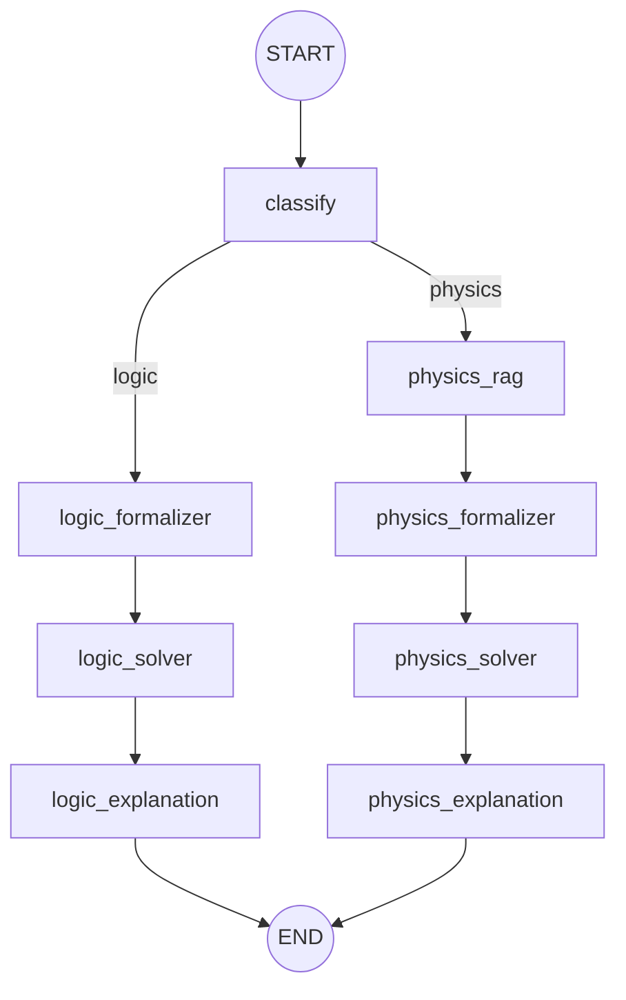

# EXACT 2026 Agent

LangGraph pipeline cho cuộc thi EXACT 2026 (IEEE IJCNN 2026).

## LangGraph Flow



Pipeline **tuyến tính (sequential)** — không chạy song song để tránh load 2 LLM
client cùng lúc (gây tràn RAM khi dùng GGUF local).

## Cấu trúc thư mục

```
src/agent/
├── __init__.py              # Export: run_pipeline, get_graph, build_graph
├── graph.py                 # Định nghĩa LangGraph workflow
├── state.py                 # AgentState TypedDict
├── schema.py                # ExactResponse Pydantic model
├── README.md
│
├── nodes/                   # Các node xử lý trong pipeline
│   ├── __init__.py
│   ├── classifier.py        # Phân loại logic/physics + Router (1 nhánh)
│   ├── logic_formalizer.py  # Dịch logic → mã Z3-Python
│   ├── logic_solver.py      # Thực thi Z3, set code_error flag
│   ├── logic_explanation.py # Tổng hợp kết quả (2 prompt: success/error)
│   ├── physics_rag.py       # Truy xuất công thức vật lý
│   ├── physics_formalizer.py# Dịch vật lý → mã SymPy
│   ├── physics_solver.py    # Thực thi SymPy, set code_error flag
│   └── physics_explanation.py # Tổng hợp kết quả (2 prompt: success/error)
│
└── prompts/
    ├── __init__.py
    ├── classify.py
    ├── logic.py             # Z3_SYSTEM_PROMPT, LOGIC_OUTPUT_PROMPT, LOGIC_OUTPUT_ERROR_PROMPT
    └── physics.py           # PHYSICS_SYSTEM_PROMPT, PHYSICS_OUTPUT_PROMPT, PHYSICS_OUTPUT_ERROR_PROMPT
```

## Cách hoạt động

### 1. Nhận request

`run_pipeline(question, premises, collection_name)` khởi tạo `AgentState` và gọi `graph.invoke()`.

### 2. Phân loại (classify)

- Nếu có `premises` → tự động phân loại là **logic**.
- Nếu không có `premises` → dùng LLM phân loại (logic hoặc physics).

### 3a. Nhánh Logic (sequential)

```
logic_formalizer → logic_solver → logic_explanation
```

- **Formalizer**: LLM dịch bài toán sang mã Z3-Python.
- **Solver**: Chạy mã Z3 trong subprocess (timeout 30s).
  - Thành công → set `code_error=False`, lưu stdout vào `code_output`.
  - Thất bại  → set `code_error=True`,  lưu stderr vào `error_message`.
- **Explanation**:
  - `code_error=False` → `LOGIC_OUTPUT_PROMPT` (tin tưởng output Z3).
  - `code_error=True`  → `LOGIC_OUTPUT_ERROR_PROMPT` (đọc code lỗi như gợi ý,
    để LLM tự suy luận ra đáp án — không gọi LLM lần thứ 2 để regenerate code).

### 3b. Nhánh Physics (sequential)

```
physics_rag → physics_formalizer → physics_solver → physics_explanation
```

- **RAG**: Truy xuất công thức vật lý từ Vector DB (hybrid search).
- **Formalizer**: LLM dịch bài toán + context RAG sang mã SymPy.
- **Solver**: Chạy mã SymPy (timeout 30s), set `code_error` flag.
- **Explanation**: Cùng pattern 2-prompt như nhánh logic, có thêm RAG context khi lỗi.

### 4. Output

`answer`, `explanation`, `fol`, `cot`, `premises`, `confidence`, `code`, `code_output`,
`code_error`, `error_message`.

## Constraint timing

Cuộc thi giới hạn **60s/bài**. Pipeline hiện tại chỉ gọi LLM **2 lần/bài**
(formalizer + explanation), không loop sinh code, đảm bảo fit trong budget.
