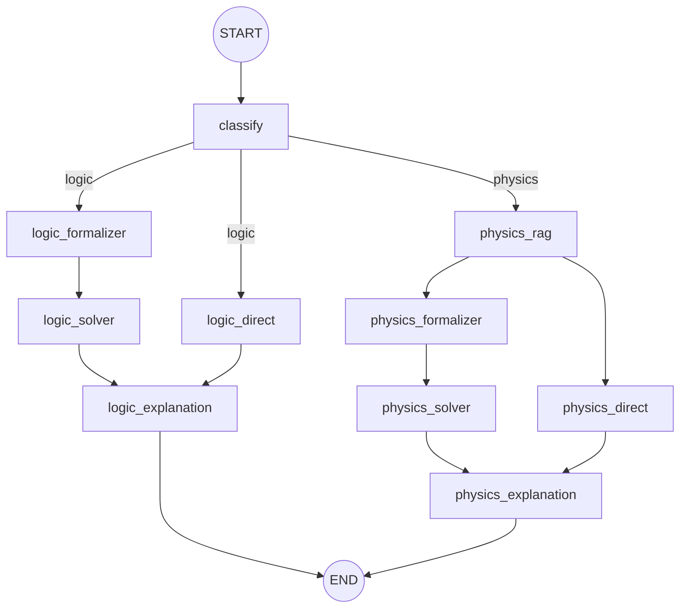

# EXACT 2026 Agent

LangGraph pipeline cho cuộc thi EXACT 2026 (IEEE IJCNN 2026).

## LangGraph Flow



## Cấu trúc thư mục

```
src/agent/
├── __init__.py              # Export: run_pipeline, get_graph, build_graph
├── graph.py                 # Định nghĩa LangGraph workflow (nodes, edges, routing)
├── state.py                 # AgentState TypedDict — trạng thái chia sẻ giữa các node
├── schema.py                # ExactResponse Pydantic model — format output cuộc thi
├── README.md
│
├── nodes/                   # Các node xử lý trong pipeline
│   ├── __init__.py
│   ├── classifier.py        # Phân loại câu hỏi (logic/physics) + Router
│   ├── logic_formalizer.py  # Dịch bài toán logic → mã Z3-Python
│   ├── logic_solver.py      # Thực thi mã Z3 trong subprocess
│   ├── logic_explanation.py # Tổng hợp kết quả Z3 → ExactResponse
│   ├── logic_direct.py      # Fallback: LLM giải logic trực tiếp
│   ├── physics_rag.py       # Truy xuất công thức vật lý từ Vector DB
│   ├── physics_formalizer.py# Dịch bài toán vật lý → mã SymPy
│   ├── physics_solver.py    # Thực thi mã SymPy trong subprocess
│   ├── physics_explanation.py# Tổng hợp kết quả SymPy → ExactResponse
│   └── physics_direct.py   # Fallback: LLM giải vật lý trực tiếp
│
└── prompts/                 # Prompt templates cho từng node
    ├── __init__.py
    ├── classify.py          # Prompt phân loại logic/physics
    ├── logic.py             # Z3 system prompt, logic output, logic direct
    └── physics.py           # SymPy system prompt, physics output, physics direct
```

## Cách hoạt động

### 1. Nhận request

`run_pipeline(question, premises, collection_name)` khởi tạo `AgentState` và gọi `graph.invoke()`.

### 2. Phân loại (classify)

- Nếu có `premises` → tự động phân loại là **logic**.
- Nếu không có `premises` → dùng LLM phân loại (logic hoặc physics).

### 3a. Nhánh Logic (chạy song song)

| Nhánh chính | Nhánh dự phòng |
|---|---|
| `logic_formalizer` → `logic_solver` | `logic_direct` |

- **Formalizer**: LLM dịch bài toán sang mã Z3-Python.
- **Solver**: Chạy mã Z3 trong subprocess (timeout 30s), lấy kết quả.
- **Direct (fallback)**: LLM giải trực tiếp không qua Z3.
- Hai nhánh hội tụ tại `logic_explanation` → tổng hợp thành `ExactResponse`.

### 3b. Nhánh Physics (chạy song song)

| Nhánh chính | Nhánh dự phòng |
|---|---|
| `physics_rag` → `physics_formalizer` → `physics_solver` | `physics_rag` → `physics_direct` |

- **RAG**: Truy xuất công thức vật lý từ Vector DB (hybrid search).
- **Formalizer**: LLM dịch bài toán + context RAG sang mã SymPy.
- **Solver**: Chạy mã SymPy trong subprocess (timeout 30s).
- **Direct (fallback)**: LLM giải trực tiếp với context RAG.
- Hai nhánh hội tụ tại `physics_explanation` → tổng hợp thành `ExactResponse`.

### 4. Output

Kết quả trả về gồm: `answer`, `explanation`, `fol`, `cot`, `premises`, `confidence`, `code`, `code_output`.
