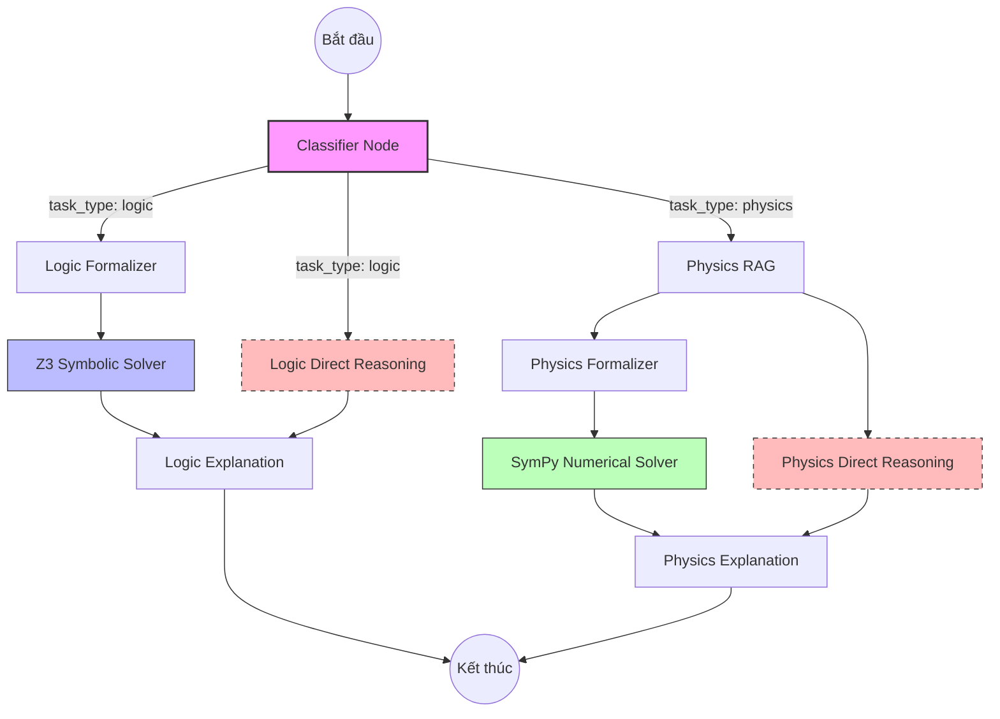

# EXACT 2026 Agent - LangGraph Pipeline

Thư mục này chứa toàn bộ logic xử lý của Agent sử dụng LangGraph, được thiết kế để giải quyết các bài toán Logic và Vật lý theo yêu cầu của cuộc thi EXACT 2026.

## 🏗️ Kiến trúc Pipeline

Hệ thống sử dụng một đồ thị trạng thái (StateGraph) để điều hướng dữ liệu qua các bước xử lý chuyên biệt. Điểm đặc trưng là khả năng **chạy song song (Parallel Fan-out)** giữa bộ giải ký hiệu (Symbolic Solver) và suy luận trực tiếp (Direct Reasoning).

### Sơ đồ luồng (Flowchart)



## 🧩 Các thành phần chính

### 1. Classifier Node
Phân loại câu hỏi đầu vào thành `logic` hoặc `physics`. 
- Đối với bài toán Logic: Hỗ trợ trích xuất các giả thiết (premises) nếu có (Type 1 input).

### 2. Logic Branch (Nhánh Logic)
- **Formalizer**: Dịch ngôn ngữ tự nhiên sang mã **Z3-Python**.
- **Solver**: Thực thi mã Z3 trong môi trường sandbox an toàn để tìm đáp án logic.
- **Direct Reasoning**: LLM suy luận trực tiếp (chạy song song) để đảm bảo luôn có kết quả dự phòng.

### 3. Physics Branch (Nhánh Vật lý)
- **RAG**: Truy xuất công thức và hằng số vật lý từ Vector DB.
- **Formalizer**: Dịch bài toán sang mã **SymPy** để xử lý đơn vị và phương trình.
- **Solver**: Tính toán con số cụ thể và đơn vị SI.
- **Direct Reasoning**: LLM suy luận trực tiếp dựa trên kiến thức vật lý nội tại.

### 4. Explanation Node (Structured Output)
Sử dụng **Pydantic Schema (`ExactResponse`)** để ép LLM trả về dữ liệu chuẩn hóa:
- `answer`: Đáp án cuối cùng (A, B, C...).
- `explanation`: Giải thích ngắn gọn.
- `fol`: Công thức Logic bậc một (nếu có).
- `cot`: Các bước lập luận chi tiết (Chain-of-Thought).
- `premises`: Các giả thiết đã sử dụng.
- `confidence`: Độ tin cậy của kết quả (0.0 - 1.0).

## 🚀 Cách sử dụng

```python
from src.agent.graph import run_pipeline

# Dành cho Logic (Type 1)
result = run_pipeline(
    question="...",
    premises=["..."]
)

# Dành cho Physics
result = run_pipeline(
    question="Calculate energy stored in C..."
)

print(result['answer'])
print(result['explanation'])
```

## 🛠️ Yêu cầu môi trường
- `z3-solver`: Bộ giải logic của Microsoft Research.
- `sympy`: Thư viện toán học ký hiệu.
- `langgraph`: Framework quản lý trạng thái agent.
